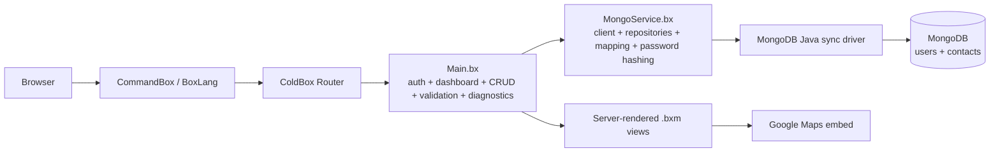
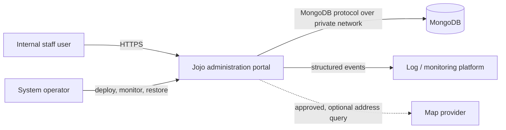
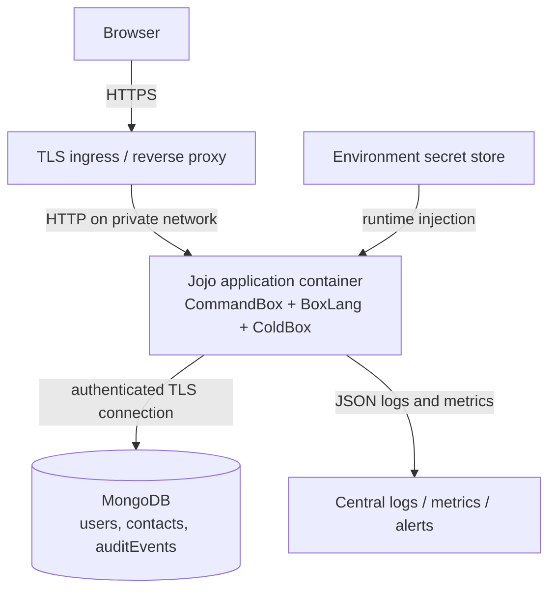
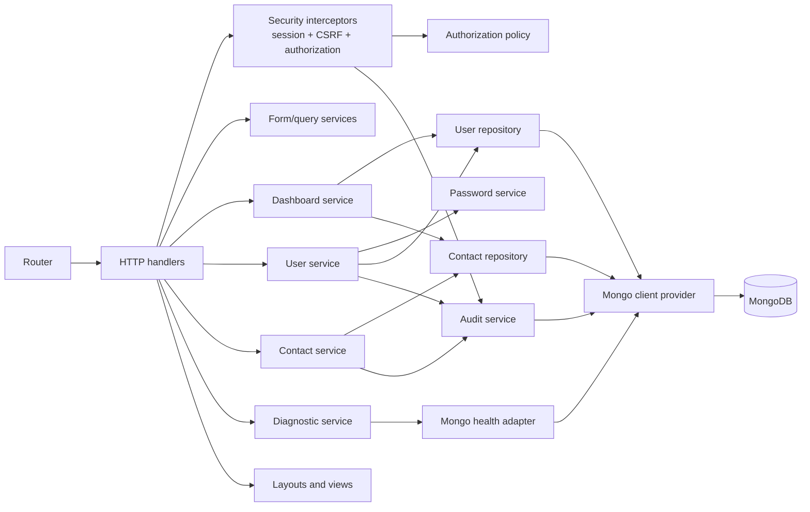
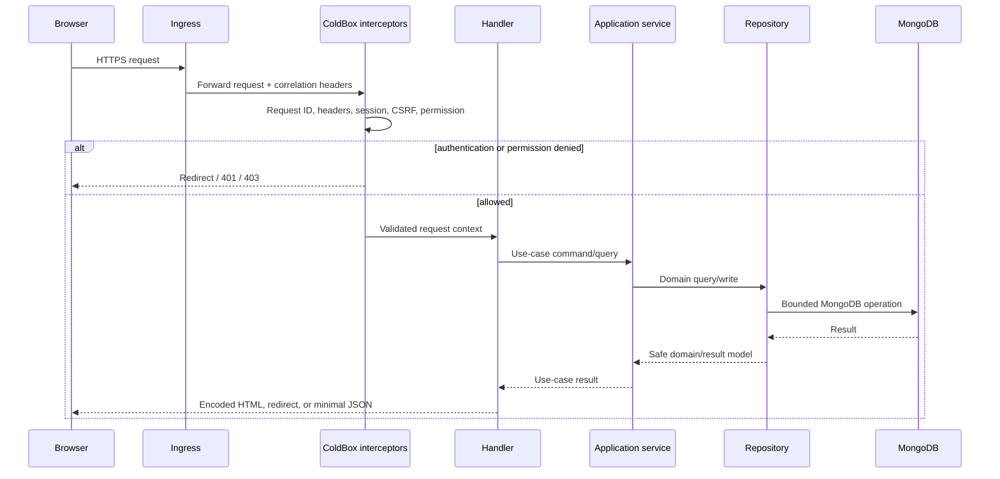

# Jojo Architecture

Status: Proposed target architecture  
Current-state reference: `BROWNFIELD_CODE_COMPREHENSION.md`  
Requirements: `PRODUCT_REQUIREMENTS.md`  
Scope: `PROJECT_SCOPE.md`

## 1. Architecture Summary

Jojo should remain a server-rendered modular monolith built with BoxLang and ColdBox, deployed as one versioned application artifact and backed by MongoDB.

This is the smallest architecture that fits the current product:

- The workflows are cohesive and share the same identity and data boundaries.
- The team can make transactional changes within one deployable application.
- Existing ColdBox routing, views, TestBox harness, and MongoDB data remain useful.
- Service boundaries can be made explicit without the operational cost of microservices or a SPA rewrite.

The primary change is internal structure: thin HTTP handlers, centralized security policy, focused application services, repositories around the MongoDB driver, and production-safe operational boundaries.

## 2. Current Architecture

Current pressure points:

- `Main.bx` combines transport, policy, application, validation, and presentation preparation.
- `MongoService.bx` combines connection lifecycle, user/contact persistence, schema setup, mapping, and password security.
- Authentication is centralized only as a private signed-in check; authorization is absent.
- Views repeat navigation and CSS.
- Health, detailed diagnostics, tests, conventional handler routes, and debug settings are not clearly separated by trust level/environment.
- Every dashboard and list request can read entire collections.

## 3. Target System Context

Trust boundaries:

1. Public/browser network to the TLS endpoint.
2. Reverse proxy or platform ingress to the BoxLang application.
3. Handler/interceptor layer to application services.
4. Repository layer to MongoDB over a private authenticated connection.
5. Optional browser-to-map-provider request containing a contact address.
6. Deployment tooling and operators to private readiness, logs, secrets, and restore functions.

## 4. Target Container Architecture

Initial deployment assumption:

- One application instance, because sessions and throttling are currently local to the process.
- MongoDB is external to the application container and has automated backups.
- TLS terminates at an ingress/reverse proxy.
- The application artifact never contains `.env`, tests, debugger configuration, database files, or development diagnostics.

Before horizontal scaling, move sessions and rate-limit counters to an approved shared store or replace local session authentication with an architecture designed for multiple instances.

## 5. Target Application Components

### Transport Layer

Proposed handlers:

- `Auth.bx`: sign-in and sign-out.
- `Dashboard.bx`: authenticated overview.
- `Users.bx`: user list and form actions.
- `Contacts.bx`: contact list and form actions.
- `Diagnostics.bx`: private readiness/details; never a public schema-management API.

Responsibilities:

- Read route/query/form values.
- Invoke authentication/authorization and application services.
- Select HTTP status, redirect, or view.
- Provide a small presentation model.
- Never build MongoDB documents or implement password policy.

ColdBox interceptors or equivalent request middleware should provide request IDs, security headers, authentication loading, CSRF validation, authorization checks, safe exception mapping, and request-duration logging.

### Application Layer

Proposed services:

- `AuthenticationService`: credential verification, active/verified checks, login event, and legacy-hash upgrade coordination.
- `AuthorizationPolicy`: permission evaluation and last-administrator rules.
- `UserService`: user use cases and audit coordination.
- `ContactService`: contact use cases and audit coordination.
- `DashboardService`: bounded aggregation/query orchestration.
- `UserFormService` and `ContactFormService`: defaults, normalization, validation, and safe form models.
- `PasswordService`: adaptive hashing, verification, hash-version detection, and migration.
- `AuditService`: append-only safe security/business events.

Application services depend on repository interfaces/conventions, not Java driver objects.

### Persistence Layer

Proposed components:

- `MongoClientProvider`: create one application-scoped client, select the configured database, verify configuration, and close it on application shutdown.
- `UserRepository`: indexed user queries and writes with domain/presentation mapping.
- `ContactRepository`: indexed contact queries and writes with domain/presentation mapping.
- `AuditEventRepository`: append and query operational audit events under a retention policy.
- `MongoHealthAdapter`: minimal ping for readiness without returning connection details.

Collection/index provisioning should be an explicit idempotent deployment/startup migration, not a side effect of ordinary list requests.

### Presentation Layer

- Keep server-rendered `.bxm` pages for the production baseline.
- Use one shared layout/navigation and shared static CSS.
- Render permission-aware navigation and action controls.
- Preserve explicit HTML and attribute encoding.
- Use progressive enhancement only where it improves confirmation, focus, and form behavior.
- Do not require Vite/Vue until a separately approved client-side use case justifies it.

## 6. Request And Security Flow

Security rules:

- TLS is mandatory outside local development.
- All state-changing browser routes validate CSRF before handler execution.
- Authentication and named permissions are checked centrally and again at business-rule boundaries where needed.
- Sign-in rotates the session identifier; sign-out invalidates the session.
- Passwords are accepted only at the auth/user service boundary and are never logged or returned.
- Password hashes use an approved adaptive algorithm. Legacy `sha256-iterated` hashes are upgraded after successful verification.
- MongoDB ObjectIds, field types, lengths, formats, enum values, and page bounds are validated before repository calls.
- Views encode untrusted output; CSP, frame, MIME-sniffing, referrer, and cookie policies are configured centrally.
- Diagnostic details require `diagnostics:read` and are unavailable in public production routes.
- Logs contain safe error codes; audit events contain identifiers and outcomes but not passwords, hashes, or full contact payloads.

## 7. Route And Permission Model

Existing URLs should remain stable while handler targets change.

| Method/path | Target component | Required permission | Notes |
| --- | --- | --- | --- |
| `GET /` | Dashboard or Auth | Public for sign-in; `dashboard:read` for dashboard | One route may continue selecting view by session state. |
| `POST /login` | Auth | Public + CSRF + rate limit | Rotates session on success. |
| `POST /logout` | Auth | Authenticated + CSRF | Invalidates session. |
| `GET /users` | Users | `users:read` | Bounded page/search query. |
| `GET /users/new` | Users | `users:write` | Create form. |
| `POST /users` | Users | `users:write` + CSRF | Create and audit. |
| `GET /users/:id/edit` | Users | `users:write` | Validates ID. |
| `POST /users/:id` | Users | `users:write` + CSRF | Update and audit. |
| `POST /users/:id/delete` | Users | `users:write` + CSRF | Last-admin guard and audit. |
| `GET /contacts` | Contacts | `contacts:read` | Bounded page/search query. |
| `GET /contacts/new` | Contacts | `contacts:write` | Create form. |
| `POST /contacts` | Contacts | `contacts:write` + CSRF | Create and audit. |
| `GET /contacts/:id/edit` | Contacts | `contacts:write` | Validates ID. |
| `POST /contacts/:id` | Contacts | `contacts:write` + CSRF | Update and audit. |
| `POST /contacts/:id/delete` | Contacts | `contacts:write` + CSRF | Confirm, delete, and audit. |
| `GET /healthcheck` | Health | Public | Liveness only: no dependency names/details. |
| `GET /ready` | Diagnostics | Platform/private network | Dependency readiness, minimal body. |
| Detailed diagnostics | Diagnostics | `diagnostics:read` and environment gate | Prefer an internal route; remove public schema creation. |

The conventional `:handler/:action?` fallback should be removed or tightly constrained so unreviewed public actions cannot become routable by convention.

## 8. Data Architecture

### Users

Current core fields:

- `_id`, `username`, `email`, `passwordHash`
- `firstName`, `lastName`
- `roles[]`, `permissions[]`
- `isActive`, `emailVerified`
- `lastLoginAt`, password-reset placeholders
- `createdAt`, `updatedAt`

Target rules:

- Unique normalized indexes on email and username.
- Explicit schema/version or migration strategy for password formats and future field changes.
- Repository projections exclude password/reset fields from every list/view model.
- Writes set timestamps server-side and enforce allowed roles/permissions.
- Search/paging indexes follow the approved query design; do not use unbounded regular-expression scans in production.

### Contacts

Current core fields:

- `_id`, `firstName`, `lastName`, `mobileNumber`
- `address`, `city`, `state`, `zip`
- `createdAt`, `updatedAt`

Target rules:

- Compound sort index beginning with normalized last and first names.
- Search-specific normalized fields or an approved MongoDB search approach at the expected volume.
- Field length and format validation at the application boundary.
- Retention and deletion policy defined because the collection contains personal contact/address data.

### Audit Events

Proposed append-only collection:

- `_id`, `occurredAt`, `requestId`
- `actorUserId`, `action`, `entityType`, `entityId`
- `outcome`, `sourceIpHash` or other approved source indicator
- `metadata` restricted to an allowlist of nonsensitive values

Indexes should support time, actor, action, and entity investigations. Retention, access, export, and tamper-resistance requirements require security/operations approval.

### Sessions

Initial production may use in-memory sessions only with one application instance and acceptance that deployment/restart signs users out. Session payloads should contain a user ID and minimal authorization snapshot or version, not a mutable copy of the full account.

Before multi-instance deployment, adopt a shared session store with encryption/authentication, expiry, and operational ownership.

## 9. Performance And Resilience

- Repositories accept explicit page, page-size, sort, and filter objects with enforced maximums.
- Dashboard counts use MongoDB count/aggregation queries instead of loading all documents.
- Map iframes use lazy loading and cannot block server rendering; a map-provider failure leaves contact management usable.
- MongoDB calls use bounded connection/server-selection/socket timeouts appropriate to each environment.
- User-facing failures use stable safe messages; logs contain the request ID and internal error category.
- Liveness does not call dependencies. Readiness checks MongoDB with a short timeout.
- Database writes return controlled conflict/not-found/unavailable results rather than broad generic catch behavior.
- Backup/restore is owned by the database platform, documented, and exercised against a non-production environment.

## 10. Configuration And Deployment

Selected deployment target:

- Azure Container Apps Consumption is the initial low-traffic hosting target.
- The application scales between zero and one replica; one is the hard maximum while sessions remain in memory.
- The production image is published to GHCR and deployed from the versioned Bicep definition under `deploy/azure/`.
- MongoDB remains external. The initial deployment may use MongoDB Atlas M0, but database ownership, backup, network allowlisting, and production suitability remain operational decisions.
- GitHub Actions authenticates to Azure with an environment-scoped OIDC federation rather than a stored client secret.

Required runtime configuration groups:

- Application: name, environment, public base URL, debug flag.
- MongoDB: URI/credential reference, database, timeouts, TLS options.
- Session: cookie name/domain/path, Secure/HttpOnly/SameSite, idle and absolute timeout.
- Security: CSRF secret/keys as required, password parameters, rate limits, trusted proxies, CSP/map feature flag.
- Observability: log level/format, service/version/environment labels, telemetry endpoint if used.

Rules:

- Secrets come from the hosting platform's secret store and are never committed.
- Production has a dedicated `server.json`/runtime override without tests, debugger, auto-reload, detailed exceptions, or broad external mappings.
- Build output excludes `.env`, `.git`, tests, local MongoDB files/logs, resources scaffolds, temporary files, and development server configuration.
- BoxLang, CommandBox image, Java, ColdBox, MongoDB driver, and MongoDB server versions are pinned and reviewed deliberately.
- Schema/index migration runs as an explicit release step with idempotency and rollback/compatibility notes.
- Deployment uses readiness before traffic and retains the previous artifact for rollback.

## 11. Test Architecture

Follow `TEST_STRATEGY.md` with these target boundaries:

- Unit: validators, normalizers, permission policy, last-admin rule, password hashing/migration, and mappers.
- Handler/request: routing, role matrix, CSRF, status/redirect/view, form errors, and safe service failures with mocked application services.
- Repository integration: indexes, pagination, search, uniqueness conflicts, mapping, and CRUD against a disposable test database.
- Security: anonymous/unauthorized access, CSRF rejection, invalid ObjectIds, rate limiting, header/cookie policy, diagnostic exposure, and secret redaction.
- Browser/accessibility: keyboard and focus behavior, labels/errors, confirmations, responsive tables/forms, and approved map/no-map modes.
- Deployment smoke: artifact contents, startup, liveness, readiness, production exposure checks, migration, rollback, and restore.

## 12. Architecture Decisions

| ID | Decision | Status | Rationale |
| --- | --- | --- | --- |
| ADR-001 | Use a modular monolith. | Proposed | Fits one cohesive product and avoids distributed-system overhead. |
| ADR-002 | Keep server-rendered ColdBox views. | Proposed | Preserves working UI and minimizes migration risk; no validated SPA need exists. |
| ADR-003 | Retain MongoDB behind repositories. | Proposed | Preserves current data and driver investment while isolating database details. |
| ADR-004 | Keep session-based browser authentication for the first release. | Proposed | Matches current HTML workflows; requires secure session controls and a single-instance constraint. |
| ADR-005 | Use permission-based authorization with roles as bundles. | Proposed | Avoids scattering role-name checks and supports future policy changes. |
| ADR-006 | Treat REST/Vite resources as optional scaffolds, not production architecture. | Proposed | Neither is needed by active workflows. |
| ADR-007 | Make schema/index changes an explicit migration step. | Proposed | Removes surprising write privileges and latency from normal requests. |
| ADR-008 | Keep detailed diagnostics private. | Proposed | Public health should not expose infrastructure or provide schema-management actions. |
| ADR-009 | Use Azure Container Apps Consumption as the initial cloud target. | Accepted | It runs the existing OCI image, supports scale-to-zero, and has an ongoing monthly free grant suitable for a low-traffic demonstration. |

After approval, move consequential decisions into individual ADR files if the team wants a permanent decision log.

## 13. Architecture Decisions Needed

1. Production logging, monitoring, and MongoDB ownership beyond the selected Azure Container Apps hosting baseline.
2. Single-instance acceptance versus a shared-session requirement for the first release.
3. Approved password algorithm available in the BoxLang/Java environment and its parameter policy.
4. Map-provider approval and the required Content Security Policy/privacy notice.
5. Search implementation based on confirmed record volume and MongoDB capabilities.
6. Audit retention, access, integrity, and privacy rules.
7. Production MongoDB version, topology, authentication/TLS, backup, and restore targets.
8. Whether `/ready` is network-private, authenticated, or both on the chosen platform.
